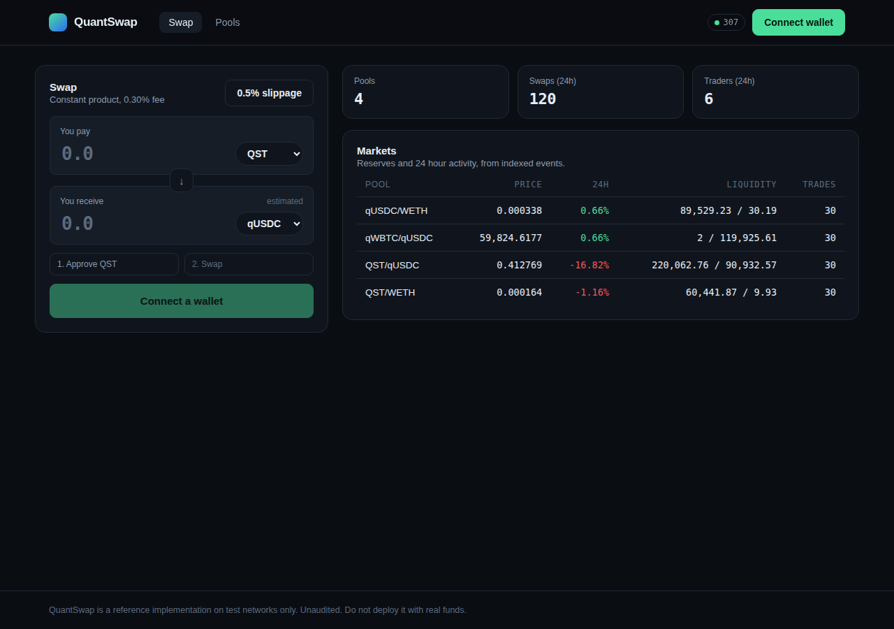
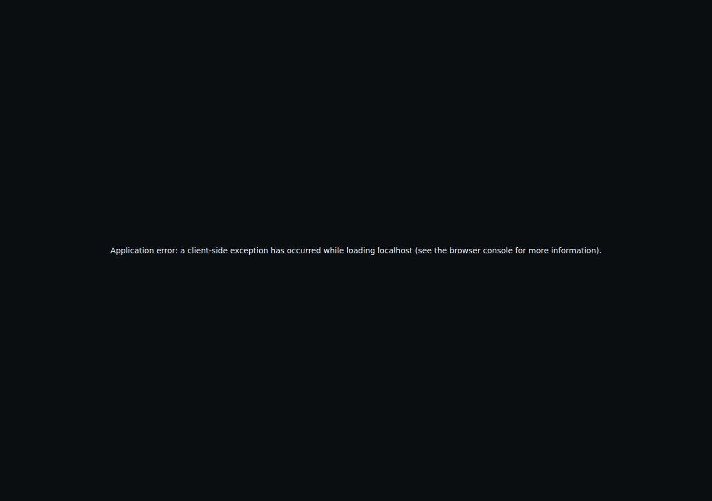

# QuantSwap — a constant product decentralised exchange

**Built by [Ismaël LADJOHOUNLOU](https://ismael-portfolio-liard.vercel.app/en)** · Solidity · Hardhat · viem · Next.js · wagmi

A constant product decentralised exchange, built end to end: Solidity contracts, an event
indexer with reorg handling, and a Next.js interface that talks to both.

It exists as a reference implementation and a portfolio piece. It is deliberately complete
rather than minimal, because the interesting parts of a DEX are the ones people skip: what
happens when the quote is stale at signature time, when the chain reorganises under the
indexer, when a token takes a fee on transfer, and when the price feed is manipulable inside
a single block.



## What is in here

| Layer | What it does | Stack |
|---|---|---|
| `contracts/` | Pair, factory, router, sliding window TWAP oracle | Solidity 0.8.28, Hardhat |
| `indexer/` | Reads logs into SQLite, serves a JSON API | Node 22, viem, `node:sqlite` |
| `web/` | Swap, pools, per-pool chart and trade feed | Next.js 15, React 19, wagmi v2, viem |
| `scripts/` | Deploy, seed a local market, export config to the front end | Hardhat, Node |

43 contract tests and 5 indexer tests, run in CI on every push.

## Quick start

Requires Node 22 or newer.

```bash
npm install
npm --prefix indexer install
npm --prefix web install

npm run compile
npm test                 # 43 contract tests

npm run node             # terminal 1: local chain
npm run setup:local      # terminal 2: deploy, seed four pools, simulate 120 trades
npm run indexer          # terminal 3: indexer + API on :4000
npm run web              # terminal 4: interface on :3000
```

`npm run setup:local` writes `deployments/localhost.json`, which is the single source of
truth for addresses: the indexer reads it directly and `scripts/export-frontend.js` copies it
plus the ABIs into `web/generated`. Change a contract, recompile, re-export, and the front end
cannot be talking to a stale interface.



## The parts worth reading

**`contracts/core/QuantSwapPair.sol`** is the pool. It never trusts an amount it is told;
every input is derived from `balance - reserve` after the transfer, and the trade is accepted
only if the constant product invariant still holds with the 0.30% fee applied. Flash swaps
fall out of the same design: the output is sent first, and the invariant check at the end is
what makes repayment mandatory.

**`contracts/periphery/QuantSwapRouter.sol`** is the user-facing entry point. Every function
that moves value takes a deadline and a slippage bound. `QuantSwapLibrary.pairFor` resolves
pools through the factory registry instead of a hardcoded CREATE2 init code hash: one extra
cold SLOAD per hop, in exchange for making an entire class of fork incident impossible.

**`contracts/oracle/QuantSwapOracle.sol`** is a sliding window TWAP over the pair
accumulators, and the test that matters is
[`does not move materially when the spot price is manipulated inside one block`](test/Oracle.test.js):
a whale takes 40% of one side, spot collapses by more than half, and the oracle moves less
than 0.5%. The companion test shows it does converge once the attacker actually holds the
skew for a full window, because a TWAP is a cost, not immunity.

**`indexer/src/indexer.js`** handles the case most indexers get wrong. Every indexed block
header is stored; before each poll, the tip is compared against the chain, and if the hash no
longer matches the indexer walks back to the fork point and deletes everything above it.
`rollbackTo` then rebuilds each affected pool's reserve snapshot from the most recent
surviving `Sync` event, rather than leaving rows describing a history that no longer exists.

**`web/components/SwapCard.tsx`** is the swap flow as a state machine: quote, approval,
signature, pending, confirmed, with the wrong-network and no-pool states handled explicitly
instead of surfacing as a revert. Approvals are for the exact trade amount, not infinite.

## Design decisions and their costs

- **Pair lookup through the factory, not a hardcoded hash.** Costs gas per hop. Removes the
  possibility of a periphery contract sending funds to an address with no code on a fork.
- **Client-side quote math mirroring the contract.** The interface can price a trade per
  keystroke without an RPC round trip. The contract stays the authority: the minimum-output
  bound is what actually protects the user, and it is computed from the same numbers shown.
- **Exact-amount approvals.** One more transaction than an infinite approval. It also means a
  compromised router cannot drain a wallet six months later.
- **Amounts as decimal TEXT in SQLite.** A uint256 does not fit in a double. Storing balances
  as floats loses the low bits silently, which is not an acceptable class of bug in a ledger.
- **No charting library.** The indexer already shapes the candles; the chart is 120 lines of
  SVG. A renderer dependency would be more code than the feature.
- **`node:sqlite` over an ORM.** The schema is six tables and the queries are the interesting
  part. Requires Node 22.

## Testing

```bash
npm test                 # contracts
npm run indexer:test     # indexer
npm run test:gas         # contracts with a gas report
```

Beyond the per-function unit tests, the suite covers the cases that actually cost money:

- reentrancy attempted from inside a flash-swap callback, rejected by the pair lock
- a flash swap repaid 99.9% of what is owed, rejected by the invariant check
- a permit signed by the wrong account, rejected by the signature check
- a fee-on-transfer token, which must revert on the strict path and succeed on the supporting one
- randomised sequences of swaps, mints and burns asserting that k never decreases and that no
  operation dilutes an existing LP's claim (`test/Invariants.test.js`, five fixed seeds so any
  failure is reproducible)

## Deploying the interface

The repository root is a Hardhat project and the app lives in `web/`, which is the first
thing that breaks a hosted deployment: pointed at the root, a build finds no Next.js app and
fails. Two ways to get it right, both already configured:

- **Set the project's root directory to `web`.** `web/vercel.json` then applies and the build
  is zero-config.
- **Leave the root directory at the repository root.** The root `vercel.json` installs and
  builds inside `web/` and publishes `web/.next`.

Both set `NEXT_PUBLIC_DEMO=1`, which matters because a public deployment has no contracts to
read: they live on a local chain the visitor does not have. In that state the interface
serves a **snapshot captured from a seeded local market** — real output of these contracts
and this indexer, frozen at a point in time — and says so on every view that uses it. The
alternative, an empty shell, shows nothing about the work; the other alternative, unlabelled
fixtures presented as live prices, is a lie.

Data sources, in the order the app tries them:

| Source | When | What it can show |
|---|---|---|
| Indexer API | `NEXT_PUBLIC_INDEXER_URL` is set and answers | everything: reserves, volume, fees, candles, trades |
| Chain multicall | a deployment exists for the connected chain | live reserves and spot price |
| Demo snapshot | `NEXT_PUBLIC_DEMO=1` and neither of the above | the full interface, labelled as a snapshot |

Point it at a real deployment by setting `NEXT_PUBLIC_INDEXER_URL` to a hosted indexer and
`NEXT_PUBLIC_DEFAULT_CHAIN_ID` to the network, after deploying the contracts there.

## Deploying to a test network

```bash
cp .env.example .env      # fill in PRIVATE_KEY and an RPC URL
npx hardhat run scripts/deploy.js --network sepolia
NETWORK=sepolia RPC_URL=$SEPOLIA_RPC_URL npm run indexer
```

Use a throwaway key. The deploy script seeds mock tokens and liquidity on test networks only.

## Status and limitations

This is unaudited software on test networks. It is a v2-style constant product design, so it
carries the known properties of that design: impermanent loss for liquidity providers, a
price that is manipulable within a block for anything reading spot rather than the TWAP, and
no protection against sandwiching beyond the user's own slippage bound. Concentrated
liquidity, permit2 integration, and private transaction routing are the obvious next steps
and are not implemented here.

See [docs/ARCHITECTURE.md](docs/ARCHITECTURE.md) for the data flow and
[docs/SECURITY.md](docs/SECURITY.md) for the threat model and the mitigations that are and
are not in place.

## Author

**Ismaël LADJOHOUNLOU** — data engineer, algorithmic trading and automation developer.
Execution systems for real money: failed fills, stale prices, idempotent retries, state that
survives a crash.

- Portfolio: <https://ismael-portfolio-liard.vercel.app/en>
- GitHub: <https://github.com/GeneralTradingSarl>
- Upwork: <https://www.upwork.com/freelancers/~01498331f7c7800fc0>
- Other work: [Cascade](https://github.com/GeneralTradingSarl/Cascade) (Instagram to WhatsApp
  automation pipeline) and
  [QuantSphere Terminal](https://github.com/GeneralTradingSarl/quantsphere-terminal)
  (C++20 quantitative finance engine)

Available for smart contract, indexing and web3 front-end work.

## Licence

GPL-3.0-or-later © 2026 Ismaël LADJOHOUNLOU. See [LICENSE](LICENSE). The core AMM design follows Uniswap V2, which is the reference
implementation of the constant product model and is itself GPL-3.0.
